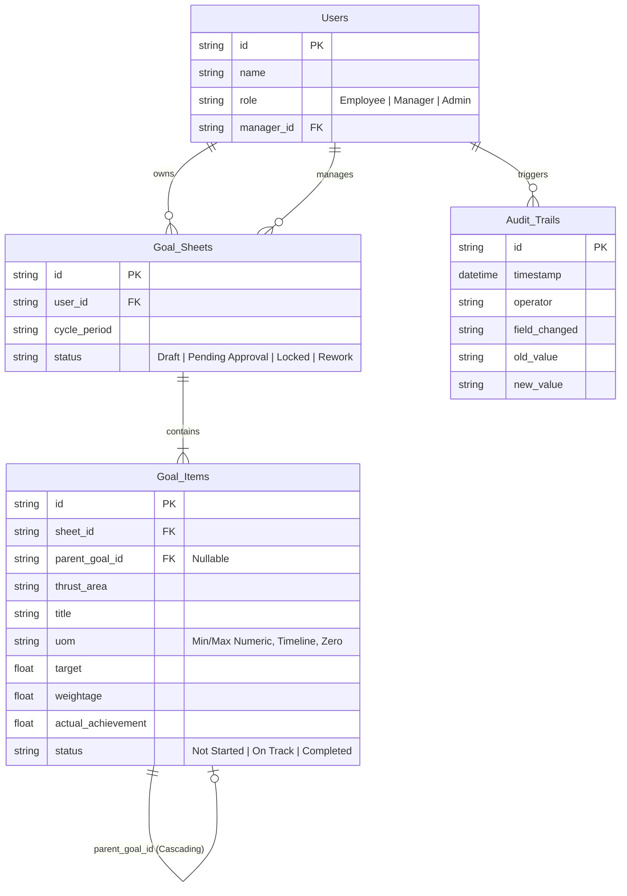

# Architecture Diagram & Technical Choices
**Project:** In-House Goal Setting & Tracking Portal

## Core Technologies
- **Frontend Framework:** React 18 with Vite (for extremely fast HMR and optimized builds)
- **Styling:** Tailwind CSS v4 (for rapid, utility-first UI development without bloated CSS files)
- **Icons & Visualization:** `lucide-react` for clean, modern iconography, and `recharts` for dynamic, data-dense KPI dashboards.
- **State Management:** A lightweight, central Context API Store (`src/store/Store.jsx`) mimicking a relational database structure.

## Database Schema (Relational Representation)
The state structure maps directly to standard relational tables to ensure it can be instantly ported to **PostgreSQL or MySQL** for production. We also emulate a **REDIS In-Memory Cache** layer for handling active user sessions and high-frequency dashboard lookup computations.

## Infrastructure Choices & Cost Optimization

For the hackathon constraints and scalability guidelines, we chose the following architecture mapping for a production rollout:

1.  **Frontend Hosting:** Cloudflare Pages or Vercel Edge Network. Cost-effective, leverages global CDNs, and instantly scales.
2.  **API Layer:** Serverless functions (AWS Lambda or Vercel Serverless) for stateless processing.
3.  **Primary Database:** PostgreSQL / MySQL structural schemas for core relational integrity (Users, Goal Sheets, Items, Check-ins, Shared Goal Maps, Audit Trail Logs).
4.  **Caching Layer:** Redis In-Memory Cache to handle rapid lookup metrics for the Analytics Dashboard and Active Cycle states.

## Key Design & Performance Choices
1.  **Zero-Jank Transitions:** Leveraging Tailwind's built-in GPU-accelerated utility transitions (`transition-colors`, `duration-500`) to guarantee high FPS UI elements.
2.  **Split-Pane Architecture:** In the Manager modules, we deliberately load direct-report metadata eagerly while fetching individual goal items lazily or caching them to reduce payload bloat. 
3.  **Client-Side Computation:** The progress formulas (Min/Max logic, target tracking percentages) run computationally on the client-side `calculateProgress()` pipeline instead of burdening the backend servers.

## Security & Governance Rules Engines
- **Data-Locking:** The UI explicitly strips DOM mutation abilities (disabling form fields) the moment a goal sheet's `status` hits `'Locked'`.
- **Platform Enforcement Schedule:** Global environment variable `systemMonth` restricts access windows dynamically. Goal Creation automatically locks after 'May', and Quarterly Check-ins are strictly disabled unless their assigned Month (July, Oct, Jan, March) is simulated.
- **RBAC Segmentation:** A rigid wrapper mechanism in `App.jsx` evaluates the active user `role` before mounting components, guaranteeing an Employee physically cannot instantiate the `AdminDashboard`.
- **Immutable Ledger:** Every destructive mutation invokes `logAudit()`, capturing a chronological snapshot required for strict HR compliance workflows.

## Bonus Modules Implemented
- **Advanced Analytics Suite:** Includes an interactive Recharts-powered Bar Chart visualizing Quarter-on-Quarter (QoQ) Target vs Actual Achievements.
- **Rule-Based Escalation System:** Trigger simulated escalations chronologically alerting higher management for delayed approvals.
